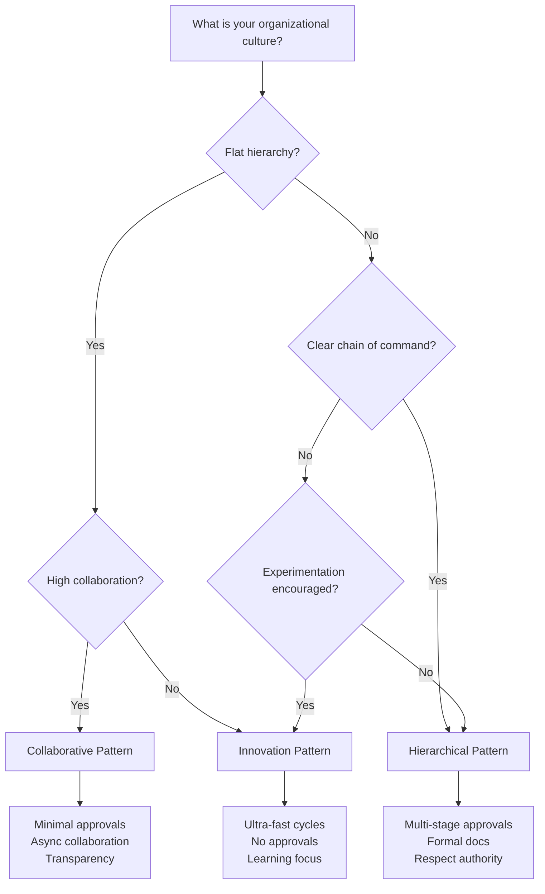
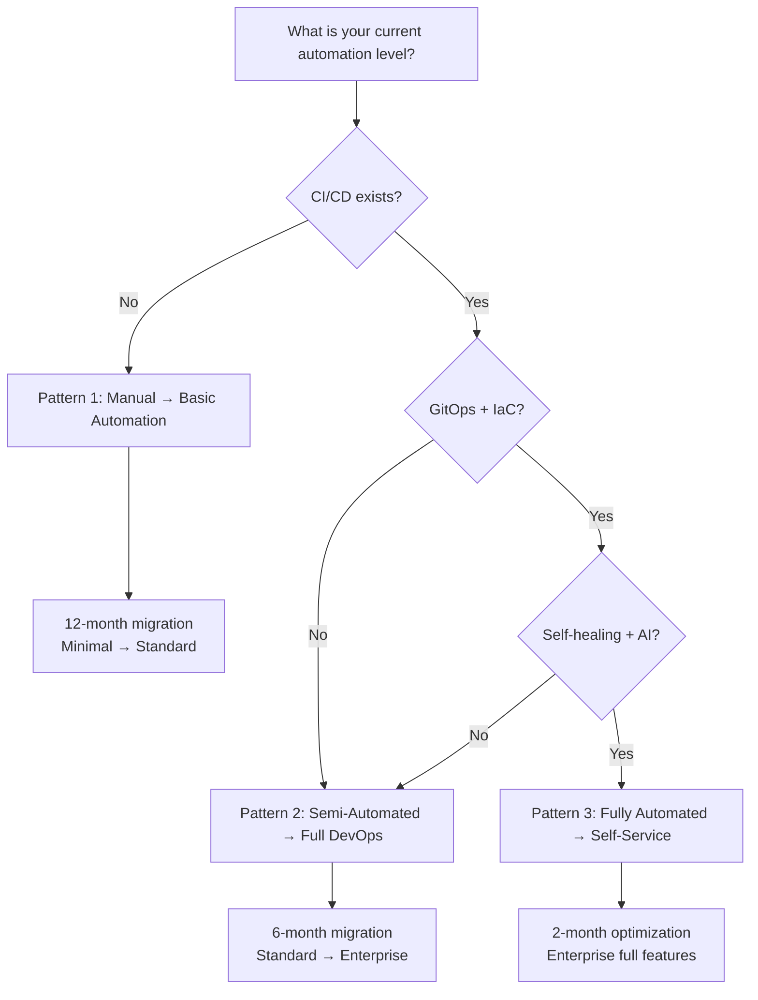
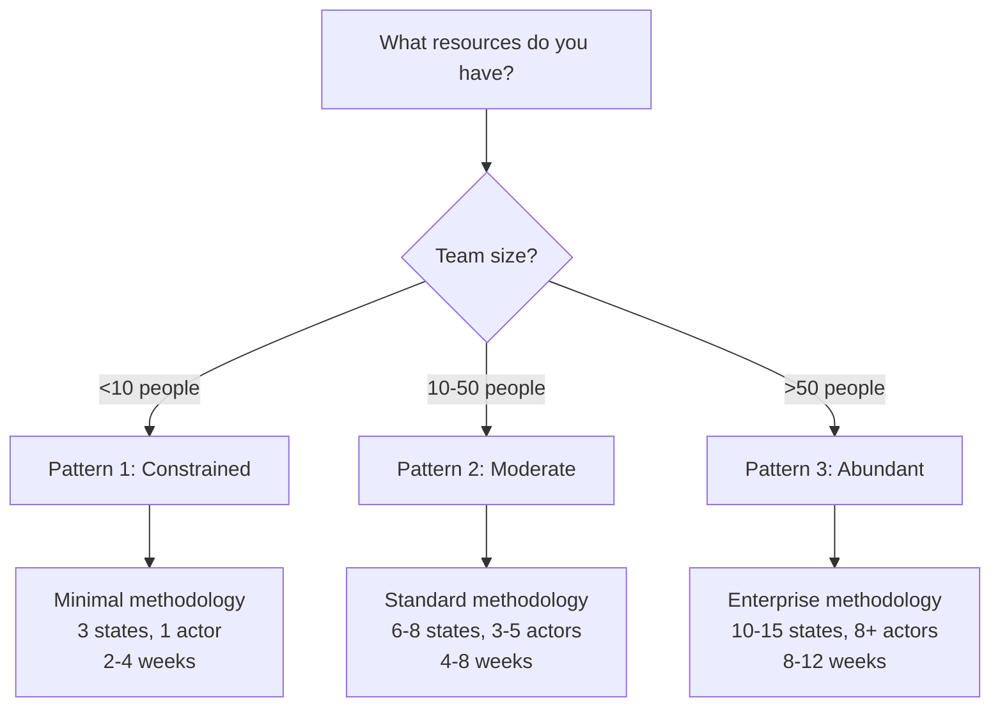

# Methodology Adaptation Patterns & Evolution Paths

**Version:** 1.0.0
**Last Updated:** 2026-01-17
**Purpose:** Concrete patterns for adapting methodology design to organizational culture, technical maturity, and resources

---

## Overview

Two organizations with the same maturity score (e.g., 65/100) can have **radically different needs** based on:
- **Culture:** Collaborative vs hierarchical
- **Tech stack:** Manual vs automated
- **Resources:** Constrained vs abundant

This guide provides **actionable patterns** for adapting methodology elements (States, Actors, Actions, Rules, Artifacts) to your specific organizational context.

**When to use:** After completing context assessment and determining maturity level

---

## Pattern Categories

1. **Cultural Adaptation Patterns:** Adjust for collaboration style, hierarchy, innovation culture
2. **Technical Maturity Patterns:** Migration paths from manual to automated
3. **Resource-Based Patterns:** Design for constrained, moderate, or abundant resources
4. **Context Transition Patterns:** Evolving from startup → scaleup → enterprise

---

## Part 1: Cultural Adaptation Patterns

Culture is 30% of readiness score for a reason - it drives adoption more than any other factor.

### Pattern 1: Collaborative Culture

**Organizational Characteristics:**
- Open communication; flat hierarchy
- Cross-functional teams standard
- Decisions made by consensus
- Transparency valued
- Async collaboration common (remote-first)

**Context Score Profile:**
```yaml
Culture: 75/100
  Collaboration: 4-5/5 (high)
  Resistance to Change: 4/5 (low resistance)
  Documentation: 3-4/5 (good)
  Learning: 4-5/5 (strong)
```

**Recommended Adaptations:**

```yaml
States:
  Adaptation: Reduce Waiting states (minimize approval delays)
  Rationale: "Collaborative teams don't need formal handoffs"
  Example: Skip APPROVAL_WAITING; use async code review in Slack

Actors:
  Adaptation: Minimize role separation
  Rationale: "Cross-functional teams share responsibilities"
  Example: engineer can do qa, pm can do engineer work
  Permissions: Broad (trust-based, not role-based)

Actions:
  Adaptation: Reduce approval stages (1-2 max)
  Rationale: "Consensus-driven; don't need 4-stage approval"
  Example: code_review_requested → approved (no formal approval state)
  Emphasize: Collaboration actions (comment, discuss, co-author)

Artifacts:
  Adaptation: Emphasize transparency (all artifacts visible)
  Rationale: "Transparency valued; no hidden docs"
  Example: All docs in shared GitHub repo, no private folders
  Format: Markdown in Git (easy async collaboration)

Rules:
  Adaptation: Minimal governance
  Rationale: "Trust-based culture; don't over-constrain"
  Example: 3-5 essential rules only; focus on quality not control
```

**Example Methodology for Collaborative Culture:**

```yaml
# Collaborative Team Workflow

states: [BACKLOG, WORKING, REVIEW, DONE]  # No Waiting states

actors:
  - id: team_member
    type: Human
    permissions: [all]  # Everyone can do everything
  - id: ai_pair_programmer
    type: AI
    tools: [copilot, code_review_mcp]

actions:
  - start_work  # Any team_member
  - request_feedback  # Async in Slack/PR
  - incorporate_feedback
  - mark_done  # Self-approval (trust-based)

artifacts:
  - id: work_doc
    location: "GitHub PR"
    visibility: public  # All team can see
    collaboration: async_comments

rules:
  - has_description
  - tests_exist
  - peer_feedback_received  # But not formal "approval"
```

**Key Principle:** Optimize for async collaboration and transparency, not formal approvals.

---

### Pattern 2: Hierarchical Culture

**Organizational Characteristics:**
- Clear chain of command
- Decisions escalate up hierarchy
- Formal approvals required
- Structured communication
- Respect for authority

**Context Score Profile:**
```yaml
Culture: 55/100
  Collaboration: 2-3/5 (siloed)
  Resistance to Change: 2/5 (high resistance)
  Documentation: 4/5 (formal docs required)
  Learning: 2/5 (reactive)
```

**Recommended Adaptations:**

```yaml
States:
  Adaptation: Add Waiting states (formal approval points)
  Rationale: "Hierarchy requires sign-offs at each level"
  Example: PM_APPROVAL → TECH_LEAD_APPROVAL → DIRECTOR_APPROVAL

Actors:
  Adaptation: Strong role separation with clear permissions
  Rationale: "Hierarchy matters; roles must be respected"
  Example: Only directors can approve production; engineers can't
  RBAC: Strict (role-based permissions enforced)

Actions:
  Adaptation: Multi-stage approval workflow (3-5 stages)
  Rationale: "Chain of command must be followed"
  Example: submit → pm_review → tech_review → director_approve
  Escalation: Define escalation paths (skip level if timeout)

Artifacts:
  Adaptation: Formal templates with sign-off sections
  Rationale: "Documentation proves approval chain"
  Example: Artifacts include "Approved by: [Name, Title, Date]"
  Format: Formal (Word docs or structured PDFs)

Rules:
  Adaptation: Comprehensive governance
  Rationale: "Hierarchy needs control; rules enforce chain of command"
  Example: 15-25 rules including who can approve what
```

**Example Methodology for Hierarchical Culture:**

```yaml
# Hierarchical Approval Workflow

states:
  - DRAFT
  - PM_REVIEW
  - TECH_LEAD_REVIEW
  - DIRECTOR_APPROVAL
  - IMPLEMENTATION
  - QA_REVIEW
  - PRODUCTION_APPROVAL
  - DEPLOYED
  - ERROR

actors:
  - id: engineer
    type: Human
    permissions: [draft, implement, fix_errors]
  - id: pm
    type: Human
    permissions: [review_requirements, approve_pm_stage]
  - id: tech_lead
    type: Human
    permissions: [review_technical, approve_tech_stage]
  - id: director
    type: Human
    permissions: [approve_production, escalate]

actions:
  - submit_for_pm_review
  - pm_approve / pm_reject
  - submit_for_tech_review
  - tech_lead_approve / tech_lead_reject
  - submit_for_director_approval
  - director_approve / director_reject
  - deploy_to_production (director only)

artifacts:
  - id: proposal
    template: |
      # Proposal
      ## Business Justification
      ...
      ## Technical Approach
      ...
      ## Approval Chain
      - PM: [Name] [Date]
      - Tech Lead: [Name] [Date]
      - Director: [Name] [Date]

rules:
  - pm_must_approve_before_tech_review
  - tech_lead_must_approve_before_director
  - director_approval_required_for_production
  - no_skip_level_approvals  # Must follow chain
  - timeout_escalation_after_3_days
```

**Key Principle:** Respect hierarchy; enforce approval chain; document authority.

---

### Pattern 3: Innovation/Experiment Culture

**Organizational Characteristics:**
- Rapid experimentation encouraged
- "Fail fast" mentality
- Learning over perfection
- High tolerance for mistakes
- Continuous iteration

**Context Score Profile:**
```yaml
Culture: 80/100
  Collaboration: 5/5 (very high)
  Resistance to Change: 5/5 (embraced)
  Documentation: 2/5 (lightweight, "code is docs")
  Learning: 5/5 (kaizen)
```

**Recommended Adaptations:**

```yaml
States:
  Adaptation: Short iterations (hours/days, not weeks)
  Rationale: "Fail fast; get feedback quickly"
  Example: [IDEA, PROTOTYPE, DEMO, ITERATE] (2-day cycles)

Actors:
  Adaptation: Minimal (everyone experiments)
  Rationale: "Low barriers to experimentation"
  Example: Single "experimenter" actor; no approvals

Actions:
  Adaptation: Lightweight; emphasize learning
  Rationale: "Move fast; learn from failures"
  Example: try_idea, demo, gather_feedback, iterate
  No approvals; optionally "share with team" but not block

Artifacts:
  Adaptation: Minimal (avoid documentation overhead)
  Rationale: "Code + demo is the artifact"
  Example: Demo video + README only; skip formal docs
  Format: Markdown, Loom video, GitHub gist

Rules:
  Adaptation: Almost none (don't constrain innovation)
  Rationale: "Rules slow experimentation"
  Example: 1-2 rules max (has_demo, shared_with_team)
  Focus: Encourage sharing learnings, not perfection
```

**Example Methodology for Innovation Culture:**

```yaml
# Rapid Experimentation Workflow

states: [IDEA, PROTOTYPING, DEMO, ITERATE]  # 2-5 day cycles

actors:
  - id: experimenter
    type: Human
    permissions: [all]  # No gatekeepers

actions:
  - start_experiment
  - demo_to_team
  - gather_feedback
  - iterate_or_pivot
  - archive_learning  # Capture what we learned

artifacts:
  - id: experiment_summary
    template: |
      # Experiment: {idea}

      ## Hypothesis
      {what_we_thought}

      ## Demo
      [Loom video link]

      ## Learning
      - What worked: ...
      - What didn't: ...
      - Next: ...

rules:
  - must_demo_within_5_days  # Ship quickly
  - must_document_learning  # Share insights

facts:
  - idea → prototyping (start_experiment)
  - prototyping → demo (demo_to_team)
  - demo → iterate (gather_feedback + decision: iterate or pivot)
```

**Key Principle:** Optimize for speed and learning, not perfection or governance.

---

## Part 2: Technical Maturity Patterns

Technical maturity determines what automation is feasible.

### Pattern 1: Manual Processes → Basic Automation

**Current State:**
```yaml
Tools: Spreadsheets, email, Slack, physical boards
Automation: None (everything manual)
CI/CD: No automated testing or deployment
Monitoring: Manual checks
```

**Target State (6-12 months):**
```yaml
Tools: Jira, GitHub, basic CI
Automation: CI runs tests automatically
CI/CD: Automated testing; semi-manual deployment
Monitoring: Basic dashboards (Grafana)
```

**Migration Path:**

#### Phase 1: Establish Tracking (Months 1-2)

```yaml
Introduce:
  - GitHub for code
  - RELEASE.md files for tracking
  - Markdown templates for artifacts

Keep Manual:
  - All approvals
  - All testing
  - All deployments

Actions:
  - All Human actors
  - Manual triggers
```

**Example:** Use hotfix workflow from SCCU (minimal bundle); all manual.

---

#### Phase 2: Add Basic CI (Months 3-4)

```yaml
Introduce:
  - GitHub Actions for tests
  - Automated test runs on PR
  - System actor: ci_bot

Keep Manual:
  - Approvals
  - Deployments

Actions:
  - Add automated: run_tests (System actor)
  - Keep manual: approve, deploy
```

**Example:** Introduce `ci_bot` actor that runs tests automatically when PR created.

---

#### Phase 3: Semi-Automated Deployment (Months 5-6)

```yaml
Introduce:
  - Deploy scripts
  - System actor: deploy_bot
  - Manual trigger, automated execution

Keep Manual:
  - Approvals

Actions:
  - Add semi-automated: deploy (Human triggers, System executes)
```

**Example:** Engineer clicks "Deploy" button; `deploy_bot` executes deployment script.

---

#### Phase 4: Automate Validators (Months 7-12)

```yaml
Introduce:
  - MCP server for validation
  - Automated P0 validators
  - AI actor: validator_ai

Fully Automated:
  - Testing (ci_bot)
  - Validation (validator_ai)
  - Deployment execution (deploy_bot)

Still Manual:
  - Strategic approvals (PM, Tech Lead)
```

**Bundle Progression:** minimal → standard

**Key Milestones:**
- Month 2: All releases tracked in RELEASE.md
- Month 4: Tests run automatically on every PR
- Month 6: Deployments scripted (click button vs manual commands)
- Month 12: Full MCP integration; automated validators

---

### Pattern 2: Semi-Automated → Full DevOps

**Current State:**
```yaml
Tools: GitHub, CI/CD, Jira, Slack
Automation: Tests automated; deployments semi-automated
CI/CD: Automated testing; manual approval gates
Monitoring: Basic (Grafana)
```

**Target State (4-6 months):**
```yaml
Tools: GitOps (ArgoCD), IaC (Terraform), Full MCP
Automation: End-to-end automated with human oversight
CI/CD: Fully automated with canary deployments
Monitoring: Real-time (Datadog) with auto-alerting
```

**Migration Path:**

#### Phase 1: Enable MCP Server (Month 1)

```yaml
Introduce:
  - MCP server (pcc or custom)
  - AI actors for code review, security scans
  - Automated validators (P0 + P1)

Actions:
  - ai_code_review (AI actor)
  - automated_security_scan (System actor)
```

---

#### Phase 2: GitOps & IaC (Month 2-3)

```yaml
Introduce:
  - Infrastructure as Code (Terraform)
  - GitOps (ArgoCD) for deployments
  - Everything in Git

Automation:
  - Infrastructure changes reviewed as code
  - Deployments triggered by Git merge
```

---

#### Phase 3: Metrics & Dashboards (Month 4-6)

```yaml
Introduce:
  - Real-time metrics collection
  - Automated dashboards (Datadog, Grafana)
  - SLA tracking

Automation:
  - Metrics collected automatically
  - Alerts triggered on SLA violations
```

**Bundle Progression:** standard → enterprise

**Key Milestones:**
- Month 1: MCP server operational; AI code review working
- Month 3: All infrastructure in Terraform; GitOps deployed
- Month 6: Real-time dashboards live; SLA tracking automated

---

### Pattern 3: Fully Automated → Self-Service

**Current State:**
```yaml
Maturity: Level 4 (Quantitatively Managed)
Tools: Full DevOps stack; MCP integrated
Automation: Highly automated; humans for strategic decisions
```

**Target State (2-4 months):**
```yaml
Maturity: Level 5 (Optimizing)
Tools: AI-native; self-healing
Automation: Self-service; teams customize methodologies
```

**Migration Path:**

#### Phase 1: Custom Integrations (Month 1-2)

```yaml
Introduce:
  - Custom MCP tools for domain-specific needs
  - Integration with external tools (Jira, Salesforce, etc.)

Self-Service:
  - Teams can add custom tools to their workflow
  - Teams can extend methodology with custom actions
```

---

#### Phase 2: Self-Healing & Predictive (Month 3-4)

```yaml
Introduce:
  - Self-healing systems (auto-rollback on errors)
  - Predictive analytics (AI predicts issues before they occur)
  - Adaptive routing (AI chooses optimal workflow path)

Automation:
  - Most errors handled automatically
  - Human intervention only for strategic decisions
```

**Bundle Progression:** enterprise (all features enabled)

---

## Part 3: Resource-Based Patterns

Resources constrain what's feasible regardless of cultural fit.

### Pattern 1: Constrained Resources (<10 people, low budget)

**Organizational Reality:**
```yaml
Team Size: <10 people
Budget: <$10k/year for tools
Time Capacity: 120% utilized (constant firefighting)
Skills: Mix of junior/mid (no senior leadership)
```

**Design Constraints:**

```yaml
Methodology Complexity: ABSOLUTE MINIMUM

Philosophy:
  - "Anything is better than nothing"
  - Focus: Get releases tracked
  - Defer: Strategic planning, comprehensive docs, governance

Bundle: minimal
Target Maturity: Level 2
Timeline: 2-4 weeks

Design:
  States: 3-4 (INIT, WORKING, DONE, ERROR)
  Actors: 1 (team_member)
  Actions: 2-3 (start, complete, fix)
  Artifacts: 1 (RELEASE.md with 5 fields)
  Rules: 0-2 (has_title, optional: has_description)

Emphasis:
  - Get releases tracked (baseline data)
  - Basic smoke tests only
  - Skip all strategic planning (BC/AC/PLAN)
  - No approvals (trust team)
  - Defer metrics (manual tracking initially)
```

**Example Workflow:**

```yaml
# Constrained Resources Workflow

states: [TODO, DOING, DONE, ERROR]

actors:
  - id: anyone
    type: Human

actions:
  - start
  - complete
  - report_error

artifacts:
  - id: release
    template: |
      # Release {version}
      - What changed: ...
      - Deployed: [date]

rules:
  - has_version
```

**Key Principle:** Something simple that works is better than nothing.

---

### Pattern 2: Moderate Resources (10-50 people, medium budget)

**Organizational Reality:**
```yaml
Team Size: 10-50 people
Budget: $10k-$100k/year for tools
Time Capacity: 90-100% utilized (some slack)
Skills: Mix of mid/senior (some expertise)
```

**Design Constraints:**

```yaml
Methodology Complexity: MODERATE

Philosophy:
  - Full feature workflow
  - Semi-automated
  - Standard documentation
  - Metrics collection

Bundle: standard
Target Maturity: Level 3
Timeline: 4-8 weeks

Design:
  States: 6-8 (full workflow with approvals)
  Actors: 3-5 (PM, Dev, QA, optional AI)
  Actions: 8-15 (mix manual/automated)
  Artifacts: 3-6 (structured YAML/JSON)
  Rules: 8-15 (quality gates)

Emphasis:
  - BC/AC for strategic planning
  - Automated testing (CI/CD)
  - Team training (half-day workshop)
  - Metrics collection (cycle time, error rate)
```

---

### Pattern 3: Abundant Resources (>50 people, high budget)

**Organizational Reality:**
```yaml
Team Size: >50 people
Budget: $100k+/year for tools
Time Capacity: 70-80% (capacity for initiatives)
Skills: Senior/expert team; thought leaders
```

**Design Constraints:**

```yaml
Methodology Complexity: COMPREHENSIVE

Philosophy:
  - Complete governance
  - Fully automated where possible
  - Comprehensive audit trail
  - ROI tracking

Bundle: enterprise
Target Maturity: Level 4-5
Timeline: 8-12 weeks

Design:
  States: 10-15 (complex flows, security/compliance gates)
  Actors: 8-15 (Human + AI + System with RBAC)
  Actions: 20-40 (granular, auditable)
  Artifacts: 12-20 (comprehensive)
  Rules: 25-40 (full governance)

Emphasis:
  - Compliance verification (SOC2, GDPR, HIPAA)
  - Multi-team coordination
  - Executive reporting (ROI dashboards)
  - Continuous optimization
```

---

## Part 4: Context Transition Framework

Organizations evolve. Methodologies must evolve with them.

### Transition 1: Startup → Scale-up

**Trigger Conditions:**
```yaml
Team Size: >20 people (was <10)
Revenue Growth: >2x YoY (rapid growth)
Process Bottlenecks: Frequent (ad-hoc doesn't scale)
Customer Demands: Increasing (need reliability)
```

**Prerequisites:**
```yaml
Current Maturity: Level 2 (Managed)
Current Bundle: minimal
Readiness Score: >50/100
Culture Score: >60/100 (collaborative, open to change)
```

**Migration Steps:**

#### Step 1: Run Readiness Assessment (Week 1)

Use `CONTEXT_ASSESSMENT.md` to score current state and target state (scaleup).

```yaml
Current: 45/100 (startup)
Target: 65/100 (scaleup)
Gap: 20 points

Focus Areas:
  - Documentation Habits: 2/5 → 3/5 (establish templates)
  - Tool Automation: 2/5 → 3/5 (add CI/CD)
  - QA: 2/5 → 3/5 (automated testing)
```

---

#### Step 2: Upgrade Bundle (Week 2)

```yaml
From: minimal bundle (5 phases)
To: standard bundle (8 phases)

New Phases Added:
  - BC_DELTA (business case analysis)
  - AC_DELTA (architectural impact)
  - PLAN_FINALIZE (detailed planning)
```

Install standard bundle:
```bash
node tools/init/dist/index.js --methodology sccu --bundle standard
```

---

#### Step 3: Train Team (Week 3-4)

```yaml
Training Program:
  - Session 1: New phases (BC, AC, PLAN) - 2 hours
  - Session 2: Structured artifacts (YAML templates) - 1 hour
  - Session 3: Metrics collection - 1 hour
  - Hands-on workshop: Walk through full workflow - 2 hours
```

---

#### Step 4: Migrate Existing Releases (Optional, Week 5)

```yaml
For In-Flight Releases:
  - Option A: Complete with old minimal workflow
  - Option B: Migrate to standard workflow (add missing phases)

Recommended: Option A (complete old way, start new releases with standard)
```

---

#### Step 5: Pilot Standard Bundle (Week 5-8)

```yaml
Pilot:
  - 1 team uses standard bundle for 2-3 releases
  - Collect metrics
  - Adjust templates/process
  - Get feedback
```

---

#### Step 6: Org-Wide Rollout (Week 9-12)

```yaml
Rollout:
  - Week 9-10: Share pilot results; train remaining teams
  - Week 11-12: All teams using standard bundle
```

**Duration:** 12 weeks (3 months) from assessment to full adoption

**Backward Compatibility:** 100% (old releases remain valid)

**Migration Checklist:**

```yaml
Pre-Migration:
  - [ ] Readiness assessment completed (score >50)
  - [ ] Team buy-in secured (leadership + IC support)
  - [ ] Migration window scheduled (not during crunch time)
  - [ ] Training sessions scheduled

During Migration:
  - [ ] Standard bundle installed
  - [ ] New processes documented
  - [ ] Team trained (4 sessions)
  - [ ] Pilot completed (2-3 releases)
  - [ ] Metrics show improvement

Post-Migration:
  - [ ] All teams using standard bundle
  - [ ] Metrics tracked (cycle time, error rate)
  - [ ] Retrospective held (what worked, what didn't)
  - [ ] Continuous improvement plan (quarterly reviews)
```

---

### Transition 2: Scale-up → Enterprise

**Trigger Conditions:**
```yaml
Team Size: >100 people (was 20-50)
Compliance Requirements: SOC2, GDPR, HIPAA emerging
Multi-Team Coordination: Required (dependencies across teams)
Customer Demands: Enterprise customers requiring audits
```

**Prerequisites:**
```yaml
Current Maturity: Level 3 (Defined)
Current Bundle: standard
Readiness Score: >70/100
Governance Score: >60/100 (willing to adopt formal governance)
```

**Migration Steps:**

#### Step 1: Assess Governance Needs (Week 1-2)

```yaml
Questions:
  - What compliance frameworks required? (SOC2, GDPR, HIPAA, FedRAMP)
  - Who needs to approve what? (Approval matrices)
  - What audit trail needed? (Artifacts, sign-offs, metrics)
  - What access controls needed? (RBAC, team-based permissions)
```

---

#### Step 2: Design Governance Workflows (Week 3-4)

```yaml
Define:
  - Approval stages (3-5 stages: Tech → Security → Compliance → Business)
  - Escalation paths (timeout → escalate to director)
  - Compliance gates (security scan, pen-test, GDPR check)
  - Audit artifacts (comprehensive sign-offs)
```

---

#### Step 3: Implement Infrastructure (Week 5-8)

```yaml
Tools:
  - SAST/DAST tools (Snyk, SonarQube)
  - Compliance dashboards
  - RBAC systems (integrate with enterprise SSO)
  - Metrics platforms (Datadog, Grafana)
```

---

#### Step 4: Pilot Enterprise Bundle (Week 9-12)

```yaml
Pilot:
  - 1 team uses enterprise bundle with full governance
  - Test approval workflows (do they bottleneck?)
  - Verify compliance (mock audit)
  - Collect feedback
```

---

#### Step 5: Train Organization (Week 13-16)

```yaml
Training:
  - Multi-day workshop (governance, compliance, RBAC)
  - Role-specific training (approvers, auditors, engineers)
  - Mock audit scenarios
```

---

#### Step 6: Phased Org-Wide Rollout (Week 17-24)

```yaml
Rollout:
  - Week 17-18: Critical teams (customer-facing)
  - Week 19-20: Internal tools teams
  - Week 21-24: All teams migrated
```

**Duration:** 24 weeks (6 months) from assessment to full adoption

**Backward Compatibility:** 100% with migration guide

**Migration Checklist:**

```yaml
Pre-Migration:
  - [ ] Governance policies defined (who approves what)
  - [ ] Compliance requirements documented (SOC2, GDPR, etc.)
  - [ ] Infrastructure deployed (SAST, RBAC, dashboards)
  - [ ] Approval workflows tested
  - [ ] Leadership buy-in secured

During Migration:
  - [ ] Enterprise bundle installed
  - [ ] Approval workflows configured
  - [ ] RBAC implemented (team-based permissions)
  - [ ] Pilot completed (full governance tested)
  - [ ] Mock audit passed

Post-Migration:
  - [ ] All teams using enterprise bundle
  - [ ] Audit trail complete (all artifacts signed)
  - [ ] Compliance verified (SOC2, GDPR certs obtained)
  - [ ] Org-wide adoption (80%+ compliance)
  - [ ] Quarterly reviews scheduled
```

---

## Rollback Strategies

Every transition should have a rollback plan.

### Rollback: Standard → Minimal

**When to rollback:**
- Team overwhelmed (<50% adoption after 8 weeks)
- Bottlenecks introduced (approval times >5 days)
- Team satisfaction <3/5

**Rollback Procedure:**

```yaml
Step 1: Announce rollback (don't treat as failure; learning experience)
Step 2: Switch back to minimal bundle
Step 3: Retrospective (what went wrong? what assumptions were invalid?)
Step 4: Re-plan (what simpler changes can we make?)
Step 5: Re-attempt migration in 3-6 months with lessons learned
```

**Data Preservation:**
- All RELEASE.md files remain valid
- Metrics collected retained (learning data)

---

### Rollback: Enterprise → Standard

**When to rollback:**
- Approval bottlenecks (>80% releases delayed due to approvals)
- Team rebellion (majority refuses to follow process)
- Business reality changed (compliance requirements removed)

**Rollback Procedure:**

```yaml
Step 1: Identify bottlenecks (which approval stages causing delays?)
Step 2: Simplify approval workflows (3 stages → 1 stage)
Step 3: Keep essential governance (security, critical approvals)
Step 4: Remove non-essential governance (nice-to-have audits)
Step 5: Monitor for 4 weeks (did it improve?)
```

---

## Decision Trees

### Decision Tree: Which Cultural Pattern?



---

### Decision Tree: Which Technical Pattern?



---

### Decision Tree: Which Resource Pattern?



---

## Summary: Pattern Selection Guide

| Your Context | Recommended Patterns |
|--------------|----------------------|
| **Collaborative startup** | Collaborative Culture + Manual→Automation + Constrained Resources |
| **Hierarchical enterprise** | Hierarchical Culture + Full DevOps + Abundant Resources |
| **Innovation lab** | Innovation Culture + (any tech) + (any resources) |
| **Scaling startup (20-50)** | Collaborative Culture + Semi-Automated + Moderate Resources |
| **Regulated enterprise** | Hierarchical Culture + Full DevOps + Abundant Resources |

---

## Next Steps

After selecting patterns:

1. **Apply patterns to your methodology design** (adjust States, Actors, Actions, Rules, Artifacts)
2. **Validate with stakeholders** (does this match our culture/tech/resources?)
3. **Pilot with 1 team** (test patterns in real environment)
4. **Iterate based on feedback** (adjust patterns as needed)
5. **Document your custom patterns** (create organization-specific variants)

---

## References

- **Context Assessment:** `CONTEXT_ASSESSMENT.md`
- **Maturity Framework:** `MATURITY_AWARE_DESIGN.md`
- **Incremental Design:** `INCREMENTAL_DESIGN.md`
- **Decision Trees:** `DESIGN_DECISIONS.md`
- **Quick Start:** `README.md`

---

**Version History:**
- 1.0.0 (2026-01-17): Initial release with cultural, technical, resource, and transition patterns
