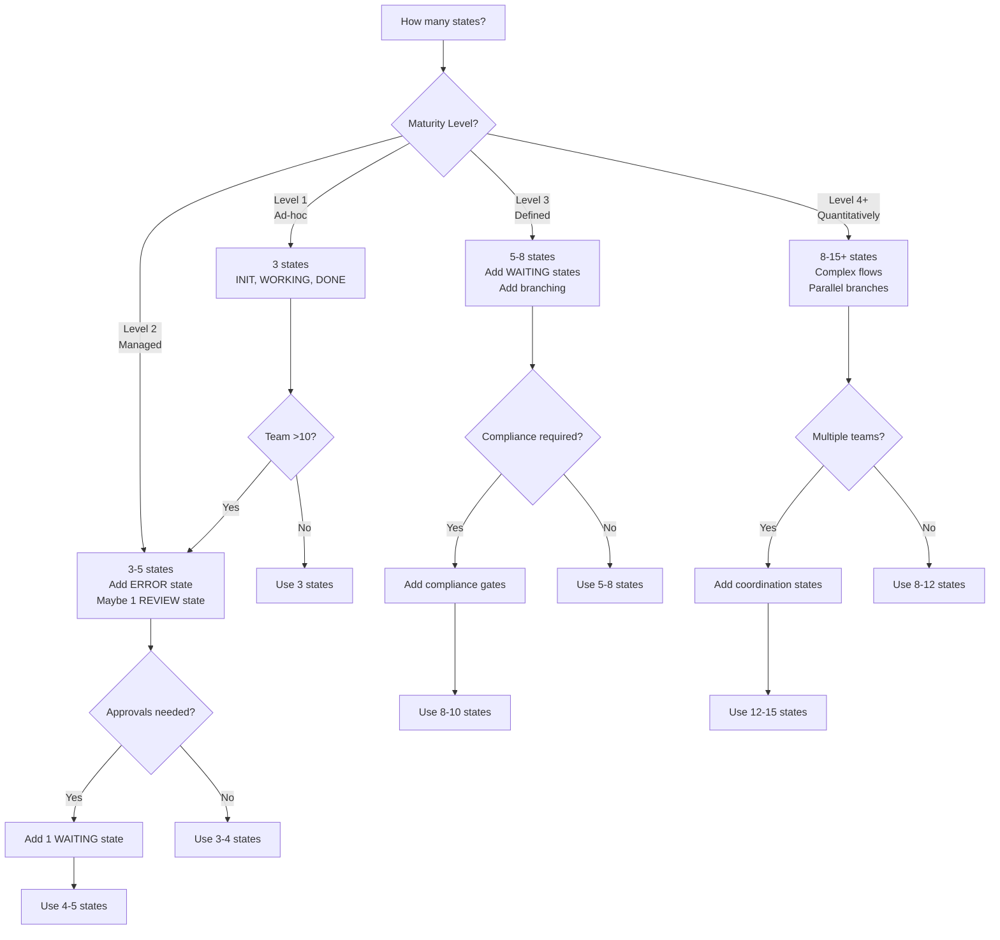
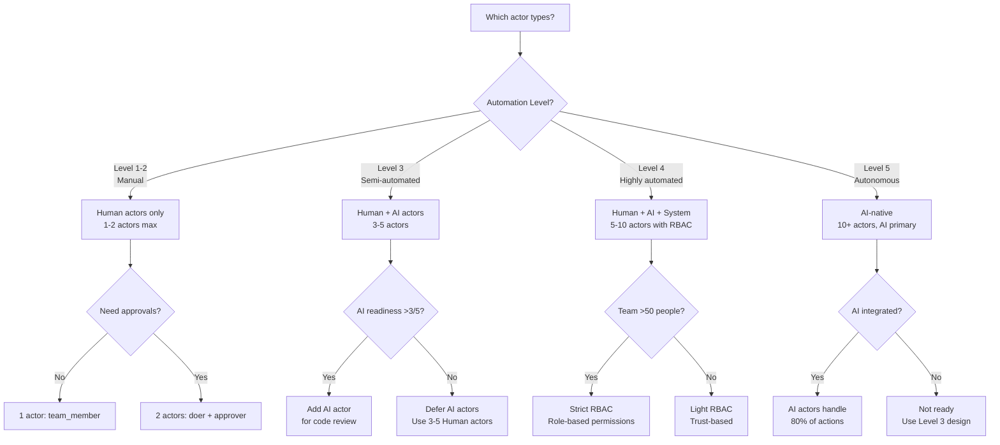
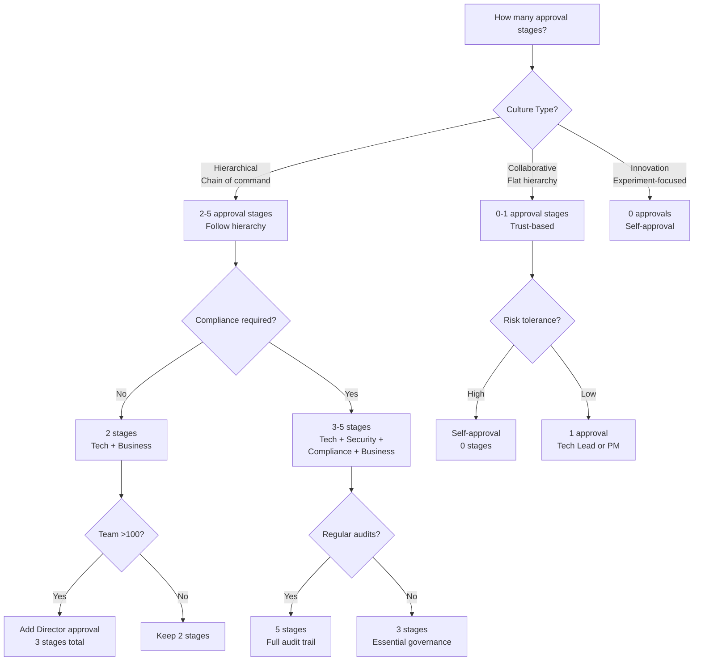
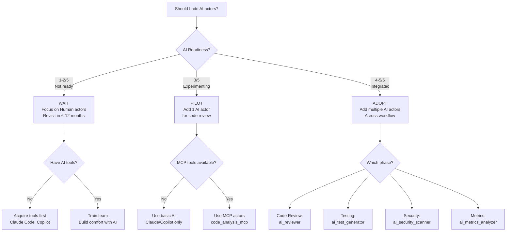
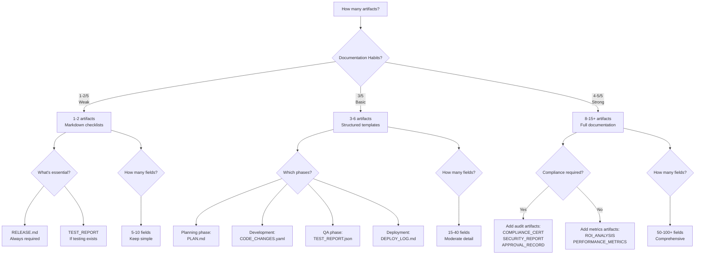
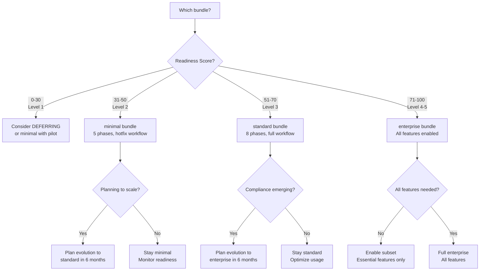

# Methodology Design Decision Trees

**Version:** 1.0.0
**Last Updated:** 2026-01-17
**Purpose:** Visual decision trees for common methodology design questions

---

## Overview

When designing a methodology, you'll face recurring questions:
- How many states should I have?
- Which actor types should I use?
- When should I add approval workflows?
- When to introduce AI actors?
- How many artifacts are needed?

This guide provides **visual decision trees** to answer these questions based on your organizational context.

**Prerequisites:** Complete context assessment (`CONTEXT_ASSESSMENT.md`) first

---

## Decision Tree 1: How Many States?



**Key Principle:** Start with fewer states. Add complexity only when needed.

**Anti-Pattern:** Designing 15-state workflow for 5-person team.

---

## Decision Tree 2: Which Actor Types?



**Key Principle:** Match actor types to your automation level. Don't add AI actors if your team isn't ready.

**Anti-Pattern:** Adding 10 AI actors when team has never used AI tools.

---

## Decision Tree 3: Approval Workflow Complexity



**Key Principle:** Match approval complexity to culture + compliance needs.

**Anti-Pattern:** 4-stage approvals in collaborative startup OR zero approvals in regulated enterprise.

---

## Decision Tree 4: When to Add AI Actors?



**Key Principle:** AI readiness 3/5+ before adding AI actors. Start with 1 AI actor (code review), then expand.

**Anti-Pattern:** Adding 5 AI actors when team has never used AI tools (will be ignored).

---

## Decision Tree 5: How Many Artifacts?



**Key Principle:** Match artifact complexity to documentation habits. Start minimal, expand as habits improve.

**Anti-Pattern:** Requiring 15 comprehensive artifacts when team's documentation habits are 2/5.

---

## Decision Tree 6: Maturity Level → Bundle Selection



**Key Principle:** Bundle selection based on readiness score. Plan for evolution, not immediate perfection.

---

## Quick Reference: Design Questions

| Question | Key Factor | Decision Range |
|----------|------------|----------------|
| **States count?** | Maturity Level | 3 (L1) → 15+ (L5) |
| **Actor types?** | Automation Level | Human only (L1-2) → AI-native (L5) |
| **Approval stages?** | Culture + Compliance | 0 (Collaborative/Innovation) → 5 (Hierarchical+Compliance) |
| **AI actors?** | AI Readiness | Wait (<3/5) → Adopt (4-5/5) |
| **Artifact count?** | Documentation Habits | 1-2 (Weak) → 15+ (Strong) |
| **Bundle?** | Readiness Score | minimal (31-50) → enterprise (71-100) |

---

## Using These Decision Trees

### Step 1: Complete Context Assessment

Use `CONTEXT_ASSESSMENT_TEMPLATE.md` to determine:
- Maturity Level (1-5)
- Readiness Score (0-100)
- Culture Type (Collaborative / Hierarchical / Innovation)
- Automation Level (1-5)
- AI Readiness (1-5)
- Documentation Habits (1-5)

### Step 2: Walk Through Decision Trees

For each methodology element (States, Actors, Actions, etc.), follow the decision tree using your context scores.

### Step 3: Document Decisions

Record your answers:
```yaml
States: ___ (count) because maturity level is ___
Actors: ___ (types) because automation level is ___
Approvals: ___ (stages) because culture is ___ and compliance is ___
AI Actors: ___ (yes/no/pilot) because AI readiness is ___
Artifacts: ___ (count) because documentation habits is ___
Bundle: ___ (minimal/standard/enterprise) because readiness score is ___
```

### Step 4: Validate with Stakeholders

Share decision rationale with team:
- "We're using 5 states (not 15) because our maturity level is 2"
- "We're starting Human actors only (no AI yet) because AI readiness is 2/5"
- "We're using 1 approval stage (not 5) because we have collaborative culture"

### Step 5: Build Methodology

Apply decisions to your `methodology.yaml` design.

---

## Common Decision Conflicts

### Conflict 1: High compliance need but low maturity

**Symptom:** Score 40/100 (Level 2) but compliance required

**Resolution:**
- Use minimal bundle (match maturity)
- Add essential compliance gates only (don't over-engineer)
- Plan evolution to enterprise bundle as maturity grows

---

### Conflict 2: Collaborative culture but compliance required

**Symptom:** Culture is collaborative (avoid approvals) but SOC2 required (need approvals)

**Resolution:**
- Use collaborative pattern for development phases (async, minimal approvals)
- Add hierarchical pattern for compliance gates only (security, legal)
- Blend patterns: minimize approvals where safe, enforce where required

---

### Conflict 3: AI-ready but team resistance

**Symptom:** AI readiness 4/5 (tools exist) but team resistance to change 2/5

**Resolution:**
- Pilot AI actors with willing early adopters first
- Make AI actors optional (Human can override)
- Collect success stories; gradually expand
- Don't force AI adoption on resistant teams

---

## Next Steps

After using decision trees:

1. **Document your design decisions** (rationale for each element)
2. **Validate with `MATURITY_AWARE_DESIGN.md`** (does your design match patterns for your level?)
3. **Apply adaptation patterns** from `ADAPTATION_PATTERNS.md` (culture-specific tweaks)
4. **Create `methodology.yaml`**
5. **Validate with `/meta-validate`**
6. **Pilot with 1 team**

---

## References

- **Context Assessment:** `CONTEXT_ASSESSMENT.md`
- **Maturity Patterns:** `MATURITY_AWARE_DESIGN.md`
- **Incremental Design:** `INCREMENTAL_DESIGN.md`
- **Adaptation Patterns:** `ADAPTATION_PATTERNS.md`
- **Quick Start:** `README.md`

---

**Version History:**
- 1.0.0 (2026-01-17): Initial release with 6 decision trees for common design questions
