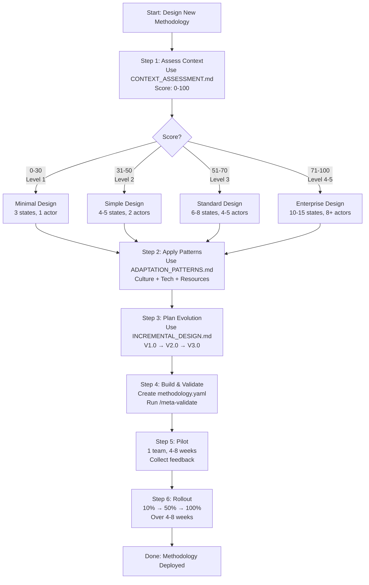

# Context-Aware Methodology Design

**Version:** 1.0.0
**Last Updated:** 2026-01-17

**Quick Start Guide for designing methodologies that match organizational reality**

---

## Overview

When designing a new methodology using the meta-methodology framework, **one size does NOT fit all**.

A methodology perfect for a 500-person enterprise with strict compliance will **overwhelm** a 5-person startup. A minimal workflow for startups will **frustrate** a mature organization that needs governance.

This guide collection helps you:
1. **Assess** your organization's context (culture, tech maturity, resources)
2. **Design** a methodology that matches your reality
3. **Evolve** incrementally as your organization matures
4. **Adapt** using proven patterns for your specific context

---

## Start Here: Design Process

---

## The 4 Core Guides

### 1. [CONTEXT_ASSESSMENT.md](./CONTEXT_ASSESSMENT.md)

**Purpose:** Assess organizational context BEFORE designing methodology

**When to use:** First step in any methodology design process

**What you'll get:**
- 5-dimensional scoring system (0-100 total score)
- Organizational readiness score
- Design recommendations for your score range
- Questionnaire template (20 questions, 20 minutes)

**Key sections:**
- Culture dimension (30% weight): Collaboration, resistance to change, documentation, learning
- Tech maturity (25%): Tools, automation, infrastructure, AI readiness
- Resources (20%): Team size, budget, time, skills
- Compliance (15%): Regulatory requirements, audits, risk tolerance
- Evolution readiness (10%): Incremental preference, rollback capability, pilot willingness

**Output:** Readiness score + design recommendations (e.g., "Score 65 → Use standard bundle with 6-8 states, 3-5 actors")

---

### 2. [MATURITY_AWARE_DESIGN.md](./MATURITY_AWARE_DESIGN.md)

**Purpose:** Design methodologies that match organizational maturity level

**When to use:** After completing context assessment

**What you'll get:**
- 5-level maturity model (CMMI-inspired)
- 6 capability areas (Process Documentation, Tool Automation, QA, Governance, Metrics, Change Management)
- Design patterns per maturity level (Level 1, Level 2, Level 3, Level 4-5)
- Example methodologies for each level
- Simplification strategies (when adapting complex designs for lower maturity)

**Key sections:**
- Level 1 (Ad-hoc): 3 states max, 1 actor, no approvals
- Level 2 (Managed): 3-5 states, 1-2 actors, single approval
- Level 3 (Defined): 5-8 states, 3-5 actors, semi-automated
- Level 4 (Quantitatively): 8-15 states, 5-10 actors, highly automated
- Level 5 (Optimizing): 10-20 states, AI-native, self-improving

**Output:** Design constraints for your maturity level (states count, actors types, approval stages, etc.)

---

### 3. [INCREMENTAL_DESIGN.md](./INCREMENTAL_DESIGN.md)

**Purpose:** Design methodologies incrementally - start simple, evolve based on usage

**When to use:** When planning initial design and evolution path

**What you'll get:**
- 3-phase design strategy (V1.0 → V2.0 → V3.0)
- Pilot program structure (8-week program)
- Pilot team selection criteria
- Phase transition checklists
- Example rollout timeline (16 weeks)

**Key sections:**
- Phase 1 (V1.0 - Core Flow): Minimal viable methodology, 2-4 weeks
- Phase 2 (V2.0 - Refinement): Add complexity based on usage, 4-8 weeks
- Phase 3 (V3.0 - Maturity): Full-featured for scale, 3-6 months
- Pilot program: Setup → Execution → Evaluation → Rollout
- Transition triggers: When to move from V1.0 → V2.0 → V3.0

**Output:** Phased evolution plan with success criteria and rollout timeline

---

### 4. [ADAPTATION_PATTERNS.md](./ADAPTATION_PATTERNS.md)

**Purpose:** Concrete patterns for adapting methodology to culture, tech maturity, and resources

**When to use:** When applying context-specific adaptations to your design

**What you'll get:**
- Cultural adaptation patterns (Collaborative, Hierarchical, Innovation)
- Technical maturity patterns (Manual→Automated, Semi-Automated→DevOps, Automated→Self-Service)
- Resource-based patterns (Constrained, Moderate, Abundant)
- Context transition framework (Startup→Scale-up, Scale-up→Enterprise)
- Rollback strategies

**Key sections:**
- Pattern 1 (Collaborative): Minimal approvals, async collaboration, transparency
- Pattern 2 (Hierarchical): Multi-stage approvals, formal docs, respect authority
- Pattern 3 (Innovation): Ultra-fast cycles, no approvals, learning focus
- Technical transitions with timelines (3-12 months)
- Context transitions with checklists

**Output:** Specific adaptations for States, Actors, Actions, Rules, Artifacts based on your context

---

## Supporting Materials

### [CONTEXT_ASSESSMENT_TEMPLATE.md](../../templates/methodology_design/CONTEXT_ASSESSMENT_TEMPLATE.md)

Interactive questionnaire with 20 questions and scoring calculator.

**Use this to:** Complete your assessment and calculate readiness score.

---

### [DESIGN_DECISIONS.md](./DESIGN_DECISIONS.md)

Decision trees with Mermaid diagrams for common design questions.

**Answers questions like:**
- How many states should I have?
- Which actor types should I use?
- When to add approval workflows?
- When to add AI actors?
- How many artifacts are needed?

---

## Recommended Reading Order

### For First-Time Methodology Designers:

1. **Start:** Read this README (you are here!)
2. **Assess:** Complete [CONTEXT_ASSESSMENT.md](./CONTEXT_ASSESSMENT.md) (use template)
3. **Design:** Read [MATURITY_AWARE_DESIGN.md](./MATURITY_AWARE_DESIGN.md) for your maturity level
4. **Plan:** Read [INCREMENTAL_DESIGN.md](./INCREMENTAL_DESIGN.md) Phase 1 only
5. **Build:** Create your V1.0 methodology using constraints from step 3
6. **Pilot:** Follow pilot program structure from step 4
7. **Iterate:** Return to guides for V2.0/V3.0 evolution

**Timeline:** 2-4 hours to read and assess, 1-2 days to design V1.0

---

### For Adapting Existing Methodologies:

1. **Assess:** Complete [CONTEXT_ASSESSMENT.md](./CONTEXT_ASSESSMENT.md)
2. **Compare:** Is your current methodology too complex or too simple for your score?
3. **Adapt:** Use [ADAPTATION_PATTERNS.md](./ADAPTATION_PATTERNS.md) to adjust
4. **Simplify or Enhance:** Use simplification strategies from [MATURITY_AWARE_DESIGN.md](./MATURITY_AWARE_DESIGN.md)
5. **Test:** Pilot adapted methodology with 1 team
6. **Roll out:** Gradual adoption using [INCREMENTAL_DESIGN.md](./INCREMENTAL_DESIGN.md)

---

## Frequently Asked Questions

### Q1: Do I really need to assess context? Can't I just use a template?

**Answer:** Templates are a starting point, but context matters enormously. A 5-person startup forcing themselves to use a 15-state enterprise workflow will fail. Spend 20 minutes on assessment to save months of frustration.

### Q2: My score is 40/100 (Level 2) but I want a sophisticated methodology. Can I skip ahead?

**Answer:** No. Design for your CURRENT maturity, not aspirations. Use incremental evolution (V1.0 → V2.0 → V3.0) to grow into sophistication over 6-12 months. Starting too complex guarantees failure.

### Q3: We're a startup now but planning to scale. Should I design for future scale?

**Answer:** No. Design minimal (V1.0) for your current 5-person team. When you grow to 20+ people, evolve to V2.0 using patterns in [ADAPTATION_PATTERNS.md](./ADAPTATION_PATTERNS.md) (Startup→Scale-up transition).

### Q4: How long does incremental evolution take?

**Answer:** Typical timeline: V1.0 (2-4 weeks) → V2.0 (4-8 weeks) → V3.0 (3-6 months). Total: 6-12 months from minimal to mature methodology.

### Q5: Can I simplify an existing complex methodology?

**Answer:** Yes. Use simplification strategies from [MATURITY_AWARE_DESIGN.md](./MATURITY_AWARE_DESIGN.md):
- Skip optional phases (BC/AC for hotfixes)
- Reduce approvals (4 stages → 1 stage)
- Defer artifacts (comprehensive docs → markdown checklists)
- Manual first (automated validators → human review)

### Q6: My culture is collaborative but we need compliance. Which pattern wins?

**Answer:** Blend patterns. Use Collaborative pattern (minimal approvals, async) for development phases, but add Hierarchical pattern (formal approvals) for compliance gates only. See [ADAPTATION_PATTERNS.md](./ADAPTATION_PATTERNS.md) for blending strategies.

### Q7: What if my pilot fails?

**Answer:** Pilot "failure" is learning. Common reasons:
1. **Too complex:** Simplify to V0.5 (even simpler than V1.0) and retry
2. **Wrong team:** Choose different pilot team (see selection criteria)
3. **Bad timing:** Defer pilot until after major deadline/crunch
4. **Missing buy-in:** Get leadership support before starting

Retrospective → Adjust → Retry in 2-4 weeks.

### Q8: How do I convince leadership to start minimal instead of comprehensive?

**Answer:** Show them this stat: 80% of comprehensive methodologies (designed upfront) fail to achieve >50% adoption. 90% of incremental methodologies (V1.0 → V2.0 → V3.0) succeed. Start small, prove value quickly, earn buy-in for evolution.

### Q9: Can I use these guides for non-software methodologies?

**Answer:** Yes! The 8-element meta-methodology (State, Actor, Tool, Action, Entity, Artifact, Fact, Rule) applies to ANY process: content creation, sales, hiring, compliance workflows, etc. The context-aware design principles are universal.

### Q10: Where do I start if I'm overwhelmed?

**Answer:** Start here:
1. Complete [CONTEXT_ASSESSMENT_TEMPLATE.md](../../templates/methodology_design/CONTEXT_ASSESSMENT_TEMPLATE.md) (20 minutes)
2. Read ONLY the section for your score in [MATURITY_AWARE_DESIGN.md](./MATURITY_AWARE_DESIGN.md) (20 minutes)
3. Design V1.0 using those constraints (2 hours)
4. Pilot V1.0 with 1 team for 4 weeks
5. Return to guides for V2.0 evolution

**Total initial time:** 3-4 hours to design V1.0.

---

## Common Anti-Patterns

### Anti-Pattern 1: "Future-Proofing"

**Symptom:** Designing 15-state workflow for 5-person team "so we don't have to redesign later"

**Why it fails:** Team gets overwhelmed, abandons methodology

**Fix:** Design for TODAY. Evolve incrementally as you grow.

---

### Anti-Pattern 2: "Aspirational Maturity"

**Symptom:** Score is 40 (Level 2) but designing Level 4 methodology "to force team to mature"

**Why it fails:** Can't force maturity through process complexity

**Fix:** Design for current maturity (Level 2), create maturity improvement plan separately.

---

### Anti-Pattern 3: "Copy-Paste Without Context"

**Symptom:** Copying another company's methodology without assessing your context

**Why it fails:** Their culture/tech/resources ≠ yours

**Fix:** Use [CONTEXT_ASSESSMENT.md](./CONTEXT_ASSESSMENT.md) first, then adapt patterns.

---

### Anti-Pattern 4: "Skipping Pilot"

**Symptom:** Rolling out methodology to entire org without testing with 1 team

**Why it fails:** Unvalidated assumptions, org-wide failure

**Fix:** Always pilot with 1 team first (8 weeks). Learn before scaling.

---

### Anti-Pattern 5: "Big-Bang Rollout"

**Symptom:** Forcing all 50 teams to adopt new methodology on same day

**Why it fails:** No capacity to support, resistance builds, chaos

**Fix:** Gradual rollout (10% → 50% → 100%) over 4-8 weeks.

---

## Getting Help

- **Questions about assessment:** See [CONTEXT_ASSESSMENT.md](./CONTEXT_ASSESSMENT.md) or use template in `templates/methodology_design/`
- **Questions about design patterns:** See [MATURITY_AWARE_DESIGN.md](./MATURITY_AWARE_DESIGN.md) for your maturity level
- **Questions about evolution:** See [INCREMENTAL_DESIGN.md](./INCREMENTAL_DESIGN.md)
- **Questions about adaptation:** See [ADAPTATION_PATTERNS.md](./ADAPTATION_PATTERNS.md)
- **Quick decisions:** See [DESIGN_DECISIONS.md](./DESIGN_DECISIONS.md) decision trees

---

## Related Resources

### In This Repository

- **Meta-methodology spec:** `namespaces/meta/README.md`
- **Process catalog:** `namespaces/meta/guides/PROCESS_CATALOG.md`
- **Group management:** `namespaces/meta/guides/GROUP_MANAGEMENT.md`
- **Validation:** Run `/meta-validate {namespace}` to check your design

### External

- **SCCU methodology:** `namespaces/sccu/` - Example of a complete methodology
- **Methodology creation process:** `namespaces/meta/processes/methodology_creation.json`

---

## Contributing

Found an issue or have a suggestion? Improvements to these guides are welcome:
1. Real-world examples of context-aware designs
2. Additional adaptation patterns for specific industries
3. Case studies of successful/failed adoptions
4. Improved questionnaires or scoring systems

---

## Changelog

- **1.0.0** (2026-01-17): Initial release with 4 core guides, template, and decision trees

---

**Next Steps:**

1. Complete [CONTEXT_ASSESSMENT_TEMPLATE.md](../../templates/methodology_design/CONTEXT_ASSESSMENT_TEMPLATE.md)
2. Read the guide for your maturity level
3. Design your V1.0 methodology
4. Pilot with 1 team
5. Iterate and evolve

Good luck designing your context-aware methodology!
