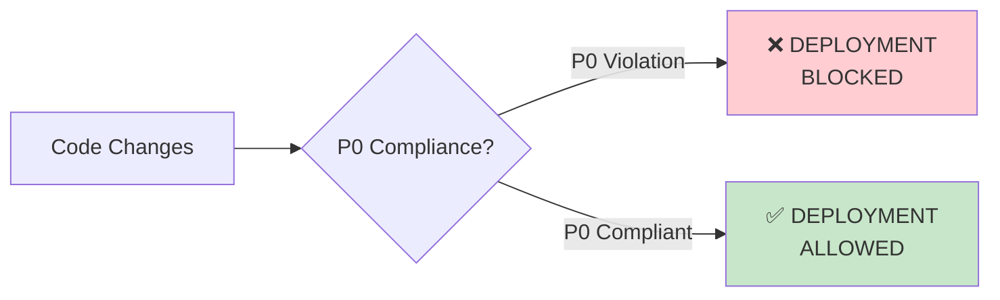

# Priority System

**Version:** 1.0.0
**Last Updated:** 2025-12-21

Система приоритизации требований для Context Studio.

---

## Обзор

Все требования в IC (Infrastructure Contexts) классифицируются по приоритетам **P0, P1, P2** для управления deployment процессом и планирования спринтов.

---

## Уровни Приоритетов

### P0 - Critical (Блокирует Deployment)

**Определение:** Требования, нарушение которых **блокирует deployment** в production.

**Характеристики:**
- 🔴 **Severity:** Critical
- ⏱️ **Timeline:** Must fix immediately
- 🚫 **Deployment:** BLOCKED until fixed
- 📊 **Impact:** Security breach, data loss, system crash

**Примеры:**
- Уязвимости безопасности (XSS, injection attacks)
- Критические баги (data corruption, auth bypass)
- Отсутствие обязательных тестов (coverage < 80%)
- Non-compliance с mandatory IC contexts

**Обозначение в документации:**
```markdown
### [P0] ALL user-generated content MUST be sanitized
- **Priority:** P0 (Critical - XSS vulnerability if violated)
- **Impact:** Security breach, user data compromise
```

---

### P1 - High (Должно быть исправлено в спринте)

**Определение:** Требования, которые **должны быть исправлены** в текущем или следующем спринте.

**Характеристики:**
- 🟡 **Severity:** High
- ⏱️ **Timeline:** Fix within 1-2 sprints
- ✅ **Deployment:** Allowed with warning
- 📊 **Impact:** Degraded UX, performance issues, accessibility violations

**Примеры:**
- Accessibility issues (WCAG violations)
- Performance degradation (LCP > 2.5s)
- Missing documentation (coverage < 90%)
- Code quality issues (высокая сложность, дублирование)

**Обозначение в документации:**
```markdown
### [P1] Implement Content Security Policy (CSP) headers
- **Priority:** P1 (High - Defense in depth)
- **Impact:** Additional XSS protection layer
```

---

### P2 - Low (Nice to Have)

**Определение:** Требования, которые **желательны, но не обязательны**.

**Характеристики:**
- 🟢 **Severity:** Low
- ⏱️ **Timeline:** Fix when time allows
- ✅ **Deployment:** No impact
- 📊 **Impact:** Minor improvements, future-proofing

**Примеры:**
- Дополнительные security tools (Snyk, OWASP ZAP)
- Оптимизации для edge cases
- Дополнительные метрики/логирование
- Экспериментальные API (Trusted Types)

**Обозначение в документации:**
```markdown
### [P2] Use automated security scanning tools
- **Priority:** P2 (Low - Additional validation)
- **Impact:** Early vulnerability detection
- Tools: Snyk, OWASP ZAP
```

---

## Матрица Приоритизации

| Severity | Frequency | Impact | Priority |
|----------|-----------|--------|----------|
| **Critical** | Any | High | **P0** |
| **High** | High | Medium | **P1** |
| **High** | Low | Low | **P1** or **P2** |
| **Medium** | High | Low | **P2** |
| **Low** | Any | Any | **P2** |

**Формула:**
```
if (severity === 'critical') return 'P0';
if (severity === 'high' && (frequency === 'high' || impact === 'medium')) return 'P1';
return 'P2';
```

---

## Deployment Rules

### P0 Violations



**Процесс при P0 нарушении:**
1. **CI/CD pipeline fails**
2. **Automated notification** to team
3. **Rollback** to last stable version (if in production)
4. **Fix immediately** (all hands on deck)
5. **Re-run validation** before retry

**Пример P0 нарушений:**
- `dangerouslySetInnerHTML` without DOMPurify → **E001: Security violation**
- Test coverage < 80% → **E003: Missing tests**
- Hardcoded API keys → **E001: Security violation**

---

### P1 Warnings

**Процесс при P1 нарушении:**
1. **CI/CD shows warning** (deployment not blocked)
2. **Create JIRA ticket** for next sprint
3. **Deploy with approval** from tech lead
4. **Track in sprint backlog**

**Пример P1 нарушений:**
- Lighthouse accessibility score < 100 → Fix in next sprint
- Performance degradation (LCP > 2.5s) → Optimize in next sprint
- Documentation coverage < 90% → Complete docs in next sprint

---

### P2 Informational

**Процесс при P2 suggestions:**
1. **CI/CD shows info message** (no action required)
2. **Optional:** Add to backlog
3. **Deploy freely**

---

## Применение Priority Markers

### В IC Contexts

**Структура:**

```markdown
## Requirements

### Mandatory (P0 - Blocks Deployment)

1. **[P0] Requirement Title**
   - **Priority:** P0 (Severity - Reason)
   - **Impact:** What happens if violated
   - Implementation details...

### Recommended (P1 - Should Fix in Sprint)

1. **[P1] Requirement Title**
   - **Priority:** P1 (Severity - Reason)
   - **Impact:** What happens if violated
   - Implementation details...

### Optional (P2 - Nice to Have)

1. **[P2] Requirement Title**
   - **Priority:** P2 (Severity - Reason)
   - **Impact:** What happens if violated
   - Implementation details...
```

**Пример (из IC_security_input_sanitization):**

```markdown
### Mandatory (P0 - Blocks Deployment)

1. **[P0] ALL user-generated content MUST be sanitized before rendering to HTML**
   - **Priority:** P0 (Critical - XSS vulnerability if violated)
   - **Impact:** Security breach, user data compromise
   - Use DOMPurify library for HTML sanitization
   - Configure allowed tags and attributes explicitly
   - Never trust user input
```

---

### В Code Review Checklist

**Структура:**

```markdown
## Security (P0)

- [ ] [P0] No hardcoded secrets/API keys
- [ ] [P0] All user input sanitized (DOMPurify)
- [ ] [P0] No `dangerouslySetInnerHTML` without sanitization

## Accessibility (P0)

- [ ] [P0] All interactive elements keyboard accessible
- [ ] [P0] ARIA labels present
- [ ] [P0] Color contrast ≥ 4.5:1

## Performance (P1)

- [ ] [P1] LCP < 2.5s
- [ ] [P1] Component bundle < 50KB
```

---

### В Test Cases

**Структура:**

```typescript
/**
 * ContextID: PC_catalog_productList
 * TestCaseID: TC_sanitize_xss
 * BasedOn: IC_security_input_sanitization
 * Priority: P0 (Critical - XSS prevention)
 */
test('[P0] sanitizes malicious HTML', () => {
  const malicious = '<script>alert("XSS")</script>';
  render(<Component content={malicious} />);
  expect(screen.queryByText(/<script>/i)).not.toBeInTheDocument();
});
```

---

## Escalation Process

### P0 Escalation

```
P0 Violation Detected
       ↓
Automated Alert to Team
       ↓
Tech Lead Assigns Owner
       ↓
Owner Fixes Immediately (<4 hours)
       ↓
Peer Review (expedited)
       ↓
Re-run CI/CD
       ↓
Deploy if Green
```

**SLA для P0:**
- **Detection → Notification:** < 5 minutes
- **Notification → Assignment:** < 30 minutes
- **Assignment → Fix:** < 4 hours
- **Fix → Deployment:** < 1 hour

---

### P1 Escalation

**Процесс:**
1. Warning появляется в CI/CD
2. Создается ticket в JIRA
3. Добавляется в backlog следующего спринта
4. Если не исправлено 2 спринта → эскалация до P0

**SLA для P1:**
- **Detection → Ticket Creation:** < 1 day
- **Ticket Creation → Sprint Planning:** Next sprint
- **Sprint Start → Resolution:** Within sprint (2 weeks)

---

## Мониторинг Priority Metrics

### Dashboard Metrics

| Metric | Target | Actual | Status |
|--------|--------|--------|--------|
| **P0 Violations in Production** | 0 | 0 | 🟢 |
| **P0 Average Resolution Time** | < 4 hours | 2.5 hours | 🟢 |
| **P1 Open Tickets** | < 10 | 7 | 🟢 |
| **P1 Average Resolution Time** | < 2 weeks | 1.2 weeks | 🟢 |
| **P2 Backlog Size** | < 50 | 32 | 🟢 |

### Automated Tracking

```typescript
// scripts/priority-tracker.ts
interface PriorityMetrics {
  p0_violations: number;
  p0_avg_resolution_hours: number;
  p1_open_tickets: number;
  p1_avg_resolution_days: number;
  p2_backlog_size: number;
}

const trackPriorities = (): PriorityMetrics => {
  // Scan CI/CD logs for P0 violations
  // Query JIRA for P1/P2 tickets
  // Calculate averages
  return metrics;
};
```

---

## Примеры по IC Contexts

### IC_security_input_sanitization

| Requirement | Priority | Reason |
|-------------|----------|--------|
| Sanitize ALL user content | **P0** | XSS vulnerability |
| No `dangerouslySetInnerHTML` without DOMPurify | **P0** | Direct attack vector |
| Validate form inputs | **P0** | Data integrity |
| Use TypeScript strict mode | **P1** | Type safety |
| Implement CSP headers | **P1** | Defense in depth |
| Use Trusted Types API | **P2** | Modern enhancement |

### IC_a11y_standards

| Requirement | Priority | Reason |
|-------------|----------|--------|
| Keyboard accessible | **P0** | Legal compliance (ADA) |
| ARIA labels | **P0** | Screen reader support |
| Color contrast ≥ 4.5:1 | **P0** | WCAG 2.1 AA |
| Focus indicators | **P1** | Usability |
| Skip links | **P1** | Navigation efficiency |
| High contrast mode | **P2** | Enhanced accessibility |

### IC_performance_budgets

| Requirement | Priority | Reason |
|-------------|----------|--------|
| LCP < 2.5s | **P0** | Core Web Vital |
| Bundle < 50KB | **P0** | Load time |
| Virtual scrolling for >100 items | **P1** | Performance |
| Image lazy loading | **P1** | Bandwidth |
| Prefetching | **P2** | UX enhancement |

---

## FAQ

### Q: Что делать, если требование находится между P0 и P1?

**A:** Используйте матрицу приоритизации (severity × frequency × impact). В спорных случаях эскалируйте до P0 (better safe than sorry).

### Q: Можно ли понизить P0 до P1 через exception?

**A:** Нет. P0 violations ВСЕГДА блокируют deployment. Exception может быть запрошен только для временного mitigation (например, feature flag для отключения функциональности до fix'а).

### Q: Как часто пересматриваются priorities?

**A:** Quarterly (каждые 3 месяца) или при major changes в security/compliance landscape.

### Q: Что делать с legacy code с P0 violations?

**A:**
1. Создать migration plan
2. Использовать feature flags для изоляции
3. Постепенно мигрировать на compliance
4. Deadline: 90 days maximum

---

## Изменения в Документации

При обновлении IC contexts с priority markers:

1. ✅ Добавить `[P0]`, `[P1]`, `[P2]` prefix к каждому требованию
2. ✅ Указать `Priority:` и `Impact:` под каждым требованием
3. ✅ Обновить `version` в frontmatter (minor bump)
4. ✅ Добавить changelog entry

**Пример changelog:**
```markdown
## Change Log

### v1.1.0 (2025-12-21)
- Added priority markers (P0/P1/P2) to all requirements
- Clarified impact for each requirement
- Updated enforcement section with priority-based rules
```

---

## Related Documents

- [CODE_REVIEW_CHECKLIST.md](CODE_REVIEW_CHECKLIST.md) - Checklist с priorities
- [IC_security_input_sanitization](../infrastructure/ic_security_input_sanitization/ic.md) - Пример с priority markers
- [SYSTEM_PROMPT.md](../SYSTEM_PROMPT.md) - Priority system overview

---

**Last Updated:** 2025-12-21
**Owner:** QA Team + Architecture Team
**Status:** 🟢 Active
